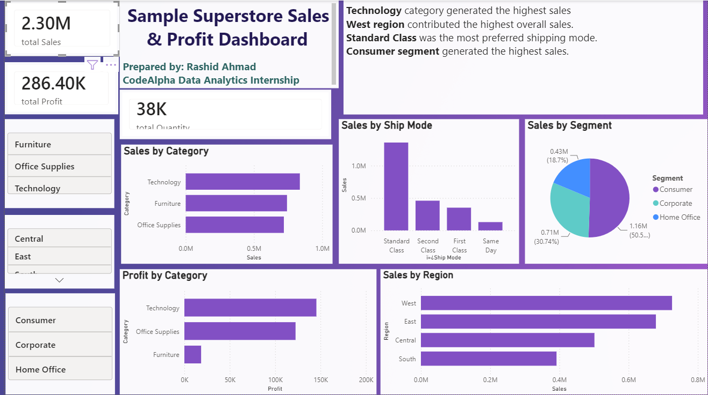

# superstore_ssles_profit_dashboard_analysis
Interactive Power BI dashboard for analyzing sales, profit, and business insights using SQL and MySQL.
# 📊 Sample Superstore Sales & Profit Dashboard

## 📌 Project Overview

This project analyzes the Sample Superstore dataset using SQL, MySQL, and Power BI. The dashboard provides interactive visualizations to help understand sales performance, profit, quantity, regional performance, shipping modes, and customer segments.

---

## 🎯 Objectives

- Analyze sales and profit performance.
- Identify the best-performing product categories.
- Compare sales across different regions.
- Analyze customer segments.
- Evaluate shipping mode performance.
- Create an interactive business dashboard.

---

## 🛠️ Tools & Technologies

- Microsoft Excel
- MySQL
- SQL
- Power BI
- GitHub

---

## 📂 Project Files

- 📊 Power BI Dashboard (.pbix)
- 📝 SQL Queries (.sql)
- 🖼️ Dashboard Screenshot (.png)

---

## 📈 Dashboard Features

- Total Sales KPI
- Total Profit KPI
- Total Quantity KPI
- Sales by Category
- Profit by Category
- Sales by Region
- Sales by Ship Mode
- Sales by Segment
- Interactive Slicers

---

## 💡 Key Business Insights

- Technology category generated the highest sales.
- West region contributed the highest overall sales.
- Standard Class was the most preferred shipping mode.
- Consumer segment generated the highest sales.

---

## 🖼️ Dashboard Preview

---

## 🚀 Skills Demonstrated

- SQL Query Writing
- Database Analysis
- Data Cleaning
- Business Intelligence
- Data Visualization
- Dashboard Design
- Analytical Thinking

---

## 👨‍💻 Author

**Rashid Ahmad**

B.Tech CSE Student

Aspiring AI Engineer | Data Analytics Enthusiast

---

## ⭐ If you like this project, don't forget to star this repository!
